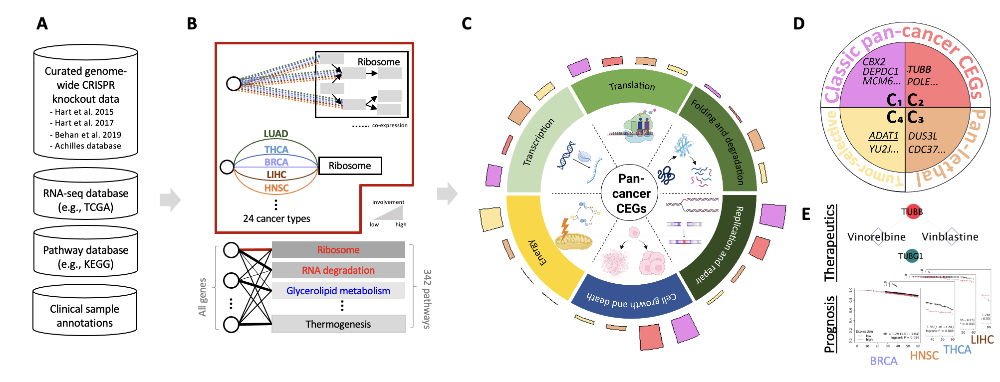
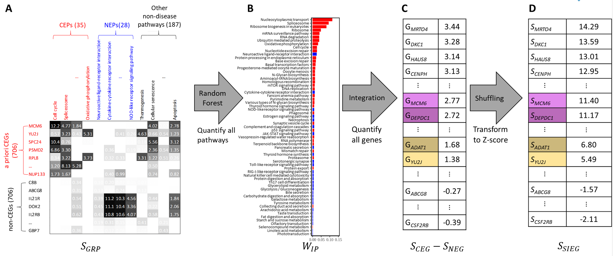

# Systematic Identification of Essential Genes (SIEG)
To construct a comprehensive catalog of pan-cancer CEGs and their corresponding mechanisms as potential therapeutic targets, we integrated diverse biological datasets and applied a machine learning model to prioritize pan-cancer essentiality based on single-gene pathway regulation behaviors. To systematically assess both genotypic and phenotypic characteristics, we incorporated genomic, transcriptomic, functional, and prognostic datasets (Fig. 1A). Subsequently, we developed SIEG model to assess functional-level essentiality by analyzing pan-cancer influence on both essential and non-essential pathways (Fig. 1B). This enabled the identification of pan-cancer CEGs, whose shared regulatory behaviors were categorized into six essential signatures (e.g., transcription, translation, folding and degradation, replication and repair, cell growth and death, energy), distinguishing different pan-cancer CEG types (Fig. 1C): C<sub>1</sub> and C<sub>2</sub> are classic pan-cancer CEGs which are in charge of DNA replication and repair and cell growth and death. C<sub>3</sub> is pan-lethal CEGs due to transcription and protein folding and degradation emerging in both tumor and normal cells. C<sub>4</sub> are tumor-selective CEGs because of the regulations of energy metabolism (Fig. 1D). To identify potential therapeutic targets, we further integrated clinical outcome data to evaluate patient survival across multiple cancers, considering both cellular and individual vulnerabilities (Fig. 1E).


**Fig 1. The Framework for essentiality quantification and pan-cancer CEGs identification.**

This repository accompanies the study and includes code for data processing and visualization. For more information, please see:
> *A Single-Gene AI Model for Identifying Core Essential Genes through Biological Interpretation from Pooled Genome-Wide CRISPR and Omics Data*
>
> Chih-Yuan Chou, Jung-Yu Lee, Chia-Hwa Lee, Jinn-Moon Yang


## Description

**Fig 2. Diagrammatic breakdown of SIEG model.**

## Data sources

A priori CEG datasets are curated from the following pooled CRISPR/Cas9 knockout references:

- [High-Resolution CRISPR Screens Reveal Fitness Genes and Genotype-Specific Cancer Liabilities](https://doi.org/10.1016/j.cell.2015.11.015) (Hart et al., _Cell_, 2015)
- [Evaluation and Design of Genome-Wide CRISPR/SpCas9 Knockout Screens](https://doi.org/10.1534/g3.117.041277) (Hart et al., _G3 Genes|Genomes|Genetics_, 2017)
- [Prioritization of cancer therapeutic targets using CRISPR–Cas9 screens](https://www.nature.com/articles/s41586-019-1103-9) (Behan et al., _Nature_, 2019)
- [Integrated cross-study datasets of genetic dependencies in cancer](https://www.nature.com/articles/s41467-021-21898-7) (Pacini et al, _Nature Communications_, 2021)

## Installation and setup
### Project dependencies
This project uses `Python` version 3.10.14.

The following `Python` packages are used in this repository:
- `numpy` (v1.24.4)
- `pandas` (v2.2.1)
- `scikit-learn` (v1.3.0)
- `mkl-random` (v1.2.4)
- `scipy` (v1.12.0)
### Project initialization
```bash
git clone https://github.com/Debby-zhou/SIEG.git

cd SIEG
```
## Usage instructions
```bash
python calculate_SIEG_score.py \
    -s TCGA_pan-cancer_PCC0.5_sgrep.txt \
    -g a_set_of_706_core_524_non-EGs_knowledge-based_pathway_enrichment.txt \
    -o CEGs_706_NotCEGs_706
```
## Help
For any technical questions regarding SIEG datasets and scripts, please contact [BioXGEM](https://bioxgem.life.nctu.edu.tw/bioxgem/). 

Thank you for your interest in our study!
